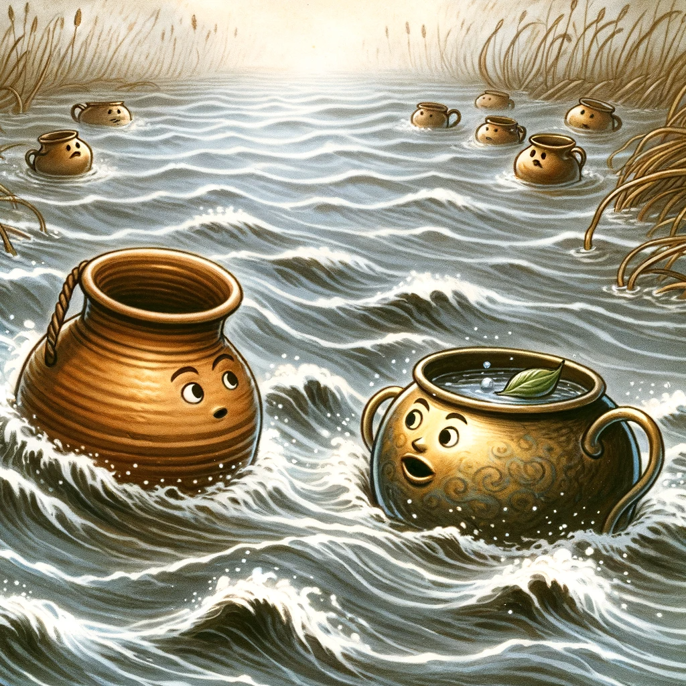

# Lerkrukan och mässingskrukan

I en översvämmad flod drev två krukor, en av lera och en av mässing, med strömmen. "Vad sägs, käre vän, eftersom vi båda är i samma situation, låt oss hålla sällskap på resan", ropade mässingskrukan till lerkrukan. Men lerkrukan svarade rädd: "Nej, håll dig undan! Om du kolliderar med mig, eller tvärtom, så kommer det att vara slutet för mig - jag kommer att krossas och sjunka."