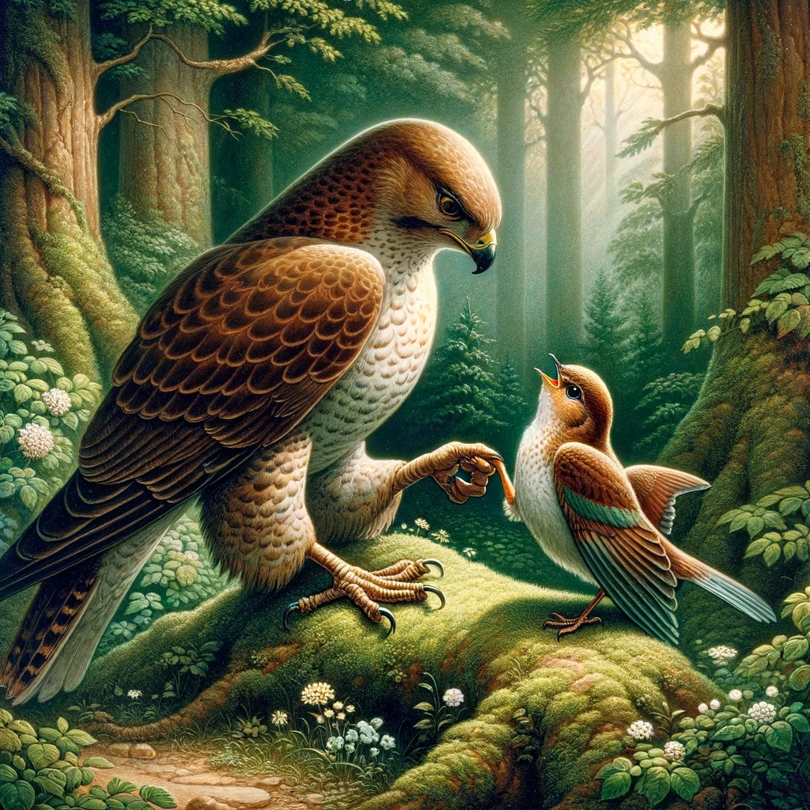

# Näktergalen och höken

En stackars näktergal hamnade i greppet på en hungrig hök som hade letat efter mat hela dagen. "Snälla, låt mig flyga iväg", bad näktergalen, "jag är för liten för att mätta din stora mage. Dessutom sjunger jag väldigt vackert. Låt mig gå och det ska bli till glädje för dig att höra min sång." "Du kommer smaka utmärkt för en hungrig mage", svarade höken, "och jag föredrar en liten fågel jag redan har framför en stor som jag ännu måste fånga."
