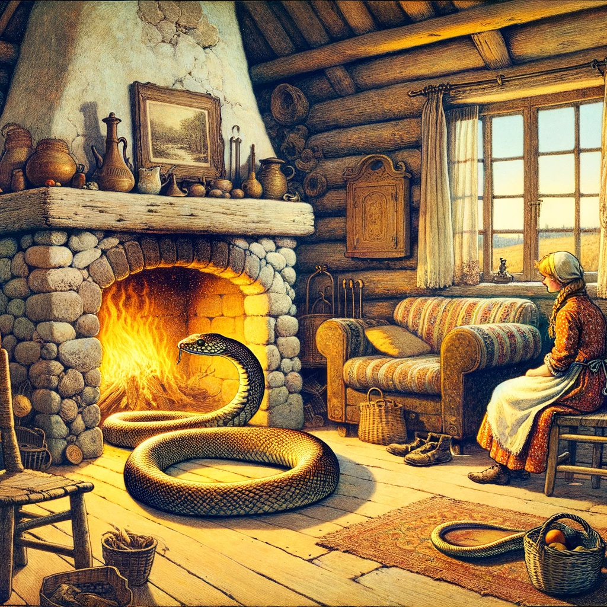

# Bonden och ormen.

En bondeman fann en iskall vinterdag under en häck en orm som var nästan helt förfrysen. Han tyckte synd om det arma djuret, tog med det hem och placerade det vid eldstaden för att värma upp det. När ormen hade återhämtat sig från värmen, reste den sig och började fräsa hotfullt mot bondens fru och barn. Mannen, som hörde deras skrik, rusade in och högg ormen i stycken med en trädgårdshacka han hade i handen. "Du olycksaliga varelse," sade han, "är detta hur du tackar den som räddade ditt liv? Dö som du förtjänar, men en vanlig död är alltför mild för dig."