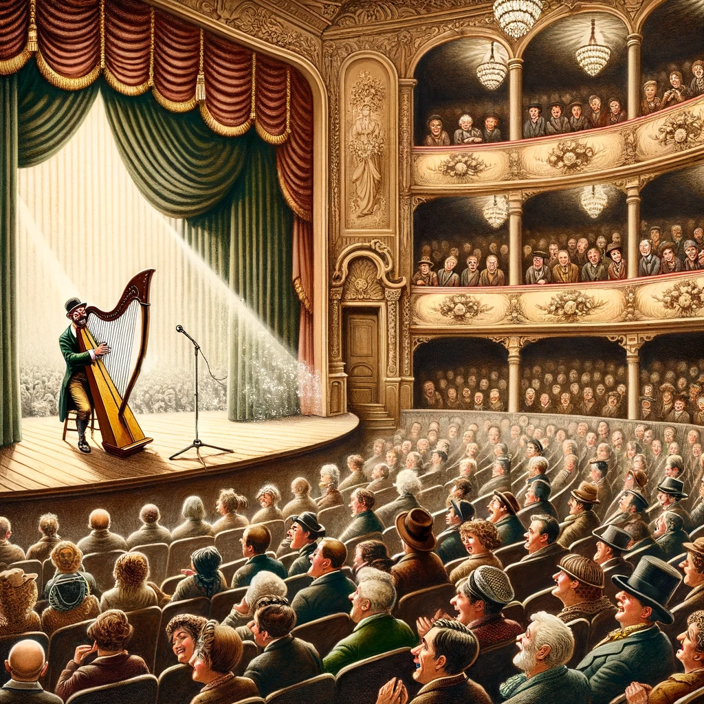

# Harpspelaren

En man som vanligtvis sjöng och spelade harpa på krogar och små festplatser, uppmuntrad av det beröm han hade fått på dessa ställen, började drömma om en större publik för att visa upp sina talanger. Han föreställde sig att om han bara skulle få spela och sjunga på en stor scen, så skulle berömmelse och framgång följa med säkerhet. Efter att ha ansträngt sig länge lyckades han slutligen få tillstånd att uppträda, men på den stora scenen försvann ljudet från hans strängar och röst, vilket resulterade i att han snabbt buades ut.
