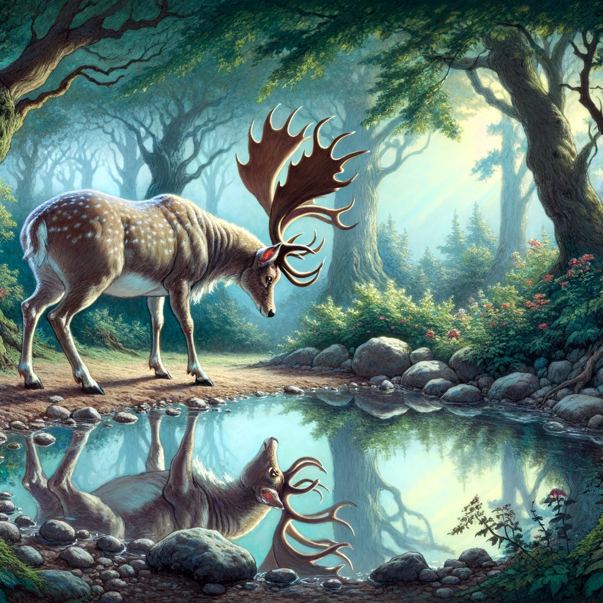

# Hjorten som beskådade sin spegelbild i dammen

En hjort som svalkade sin törst i en klar damm, beundrade spegelbilden av sina praktfulla horn men irriterades över synen av sina smala och fula ben. "Vilka ståtliga horn!" utbrast han. "Hur bra de pryder min panna, vilket häftig utseende de ger mitt ansikte! Men mina ben, smala som en tranas, får mig att skämmas djupt."

Ord hade knappt yttrats förrän han såg några jägare och en grupp hundar närma sig. Hans nedvärderade ben förde honom snabbt på säkert avstånd från förföljarna, men när han kom in i skogen fastnade hans horn i varje sväng, vilket gjorde att hundarna snabbt kom närmare och till slut dödade honom. "Vilken idiot jag var!" utbrast han. "Om jag inte haft dessa fördömda horn skulle mina ben ha räddat mitt liv."